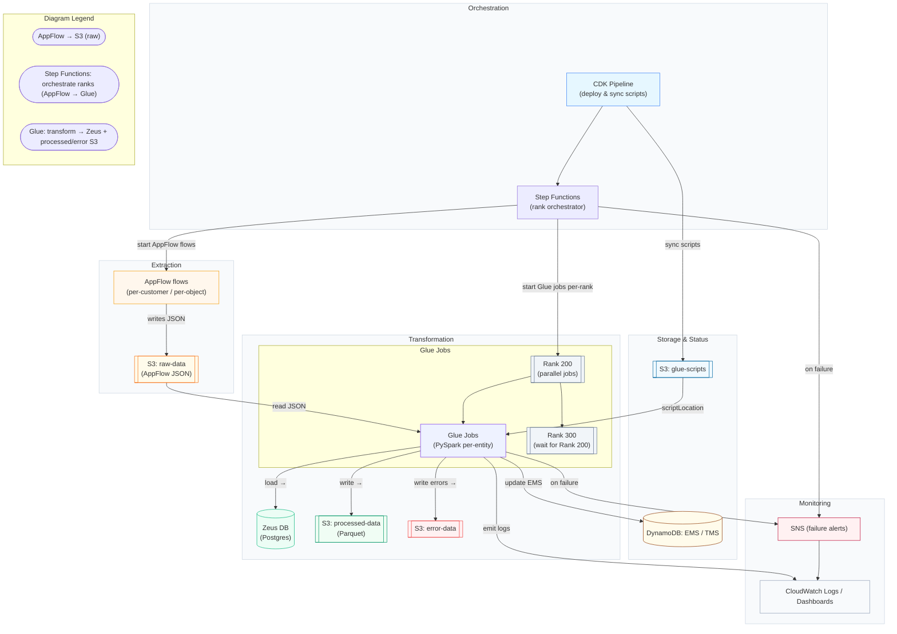

# Migration Architecture (Mermaid)

This diagram summarizes the `protagona-migration-tool` architecture: extraction (AppFlow), storage, orchestration (Step Functions), transformation (Glue), target (Zeus DB), and monitoring/status tables.

Usage notes
- The Step Functions state machine runs ranks sequentially (e.g., 200 → 300 → ...). For each rank: start AppFlow flows (parallel per source object), wait for completion, then start Glue jobs (parallel per entity).
- Glue jobs use job bookmarks and Spark optimizations; they load ID mapping caches for FK resolution and update EMS/TMS DynamoDB tables after processing.
- The CDK pipeline deploys stacks and uploads Glue scripts to the `scripts` bucket referenced by the Glue jobs.

You can open this file in Markdown preview to render the Mermaid diagram. If you want an expanded diagram (showing sample entities, rank ordering, Glue job DPU allocations, or a swimlane view), tell me which details to include and I’ll update it.